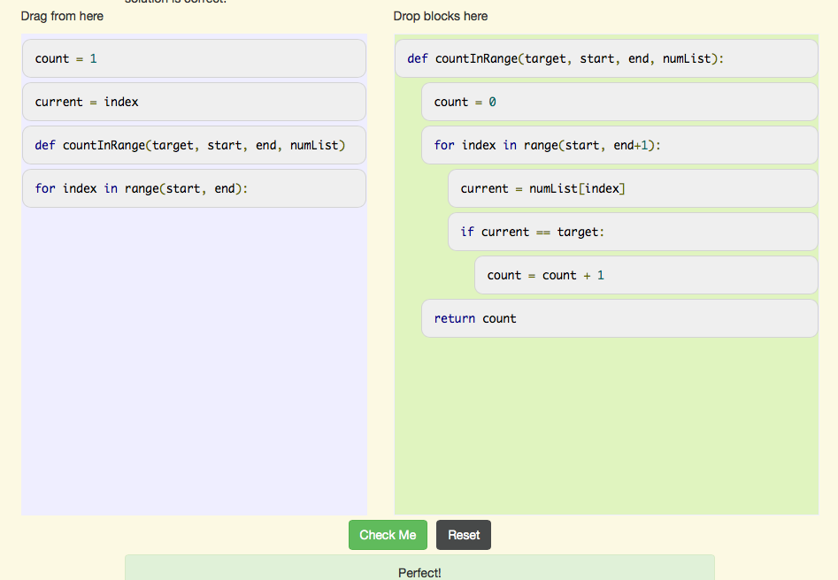

..  Copyright (C)  Mark Guzdial, Barbara Ericson, Briana Morrison
    Permission is granted to copy, distribute and/or modify this document
    under the terms of the GNU Free Documentation License, Version 1.3 or
    any later version published by the Free Software Foundation; with
    Invariant Sections being Forward, Prefaces, and Contributor List,
    no Front-Cover Texts, and no Back-Cover Texts.  A copy of the license
    is included in the section entitled "GNU Free Documentation License".

.. setup for automatic question numbering.

.. 	qnum::
	:start: 1
	:prefix: 4-1-a-
	
.. |right| image:: Figures/rightArrow.png
    :height: 24px
    :align: top
    :alt: right arrow for next page
	

Answer 1: Count Target Values in Range
----------------------------------------

To count the target value in a range from a start index to an end index inclusive, initialize a count to zero and then loop through all the values in the list from the start index to the end index.  Remember that the range function return from the first to the last - 1 so you must loop from the start index to the end index + 1. If the current value is equal to the target value increment the count. Return the count.

    Figure 1: The answer to count the target values in a range (inclusive)
  
Click the right arrow |right| near the bottom right of this page to go to the next page    