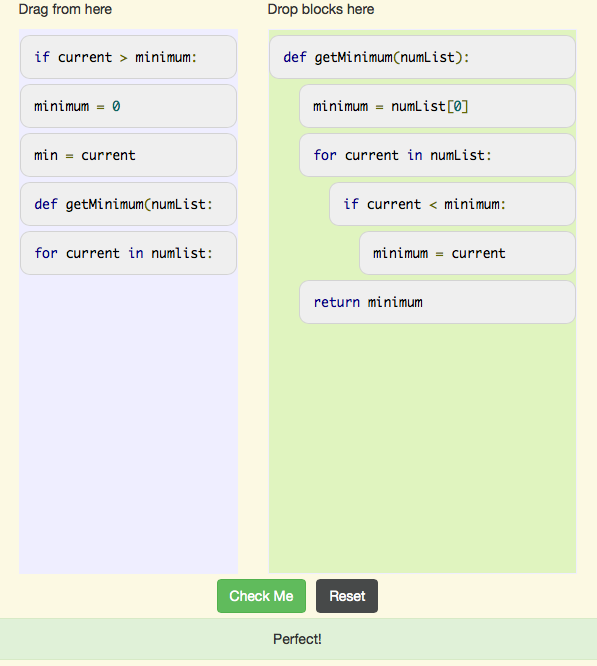

..  Copyright (C)  Mark Guzdial, Barbara Ericson, Briana Morrison
    Permission is granted to copy, distribute and/or modify this document
    under the terms of the GNU Free Documentation License, Version 1.3 or
    any later version published by the Free Software Foundation; with
    Invariant Sections being Forward, Prefaces, and Contributor List,
    no Front-Cover Texts, and no Back-Cover Texts.  A copy of the license
    is included in the section entitled "GNU Free Documentation License".

.. setup for automatic question numbering.

.. 	qnum::
	:start: 1
	:prefix: 4-2-a-
	
.. |right| image:: Figures/rightArrow.png
    :height: 24px
    :align: top
    :alt: right arrow for next page
	

Answer 2: Find the Minimum Value
---------------------------------

To find the minimum value, create a variable to keep track of the minimum value found so far and set it to the first item in the list to start.  Then loop through all the values in the list and each time test if the current value is less than the saved minimum value.  If it is, then set the minimum value to the current value.  Return the minimum value.

    Figure 1: The answer to find the minimum value
  
Click the right arrow |right| near the bottom right of this page to go to the next page       