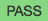

..  Copyright (C)  Mark Guzdial, Barbara Ericson, Briana Morrison
    Permission is granted to copy, distribute and/or modify this document
    under the terms of the GNU Free Documentation License, Version 1.3 or
    any later version published by the Free Software Foundation; with
    Invariant Sections being Forward, Prefaces, and Contributor List,
    no Front-Cover Texts, and no Back-Cover Texts.  A copy of the license
    is included in the section entitled "GNU Free Documentation License".

.. setup for automatic question numbering.

..     qnum::
    :start: 1
    :prefix: 4-1-
    
.. |runbutton| image:: Figures/run-button.png
    :height: 20px
    :align: top
    :alt: run button
    

.. |checkme| image:: Figures/checkMe.png
    :height: 20px
    :align: top
    :alt: check me
    
.. |start| image:: Figures/start.png
    :height: 24px
    :align: top
    :alt: start
    
.. |finish| image:: Figures/finishExam.png
    :height: 24px
    :align: top
    :alt: finishExam
    

Example 1: Count Target Values
---------------------------------

One of the common things to do with a list is to count the number of times a target value appears in a list.  To do this initialize a count to zero and then loop through all the values in the list.  If the current value is equal to the target value increment the count.  Return the count.  

Examples
========

For example ``countTargetValues(5, [1, 2, 3])`` should return 0 since there are no 5's in the list and ``countTargetValues(5, [5, 4, 5])`` should return 2 since there are two 5's in that list.

Run Code 
=========

Click the |runbutton| button to run the tests that check that this code is working correctly.  All tests should print |pass| since this is correct code.  Scroll down to try to solve the practice problem below.

.. activecode:: Count_Targets
   :nocodelens:

   # define the function
   def countTargetValues(target, numList):
   
       # initialize the count
       count = 0
  
       # loop through all the indices
       for index in range(len(numList)):
       
           # get current at index
           current = numList[index]
       
           # if match
           if (current == target):
           
               # increment the count
               count = count + 1
               
       # return the count
       return count
       
   ====
       
   # code to test the countTargetValues function
   from unittest.gui import TestCaseGui

   class myTests(TestCaseGui):

       def testTarget(self):
           self.assertEqual(countTargetValues(5, [1, 2, 3]), 0, "Test of countTargetValues(5, [1, 2, 3])");
           self.assertEqual(countTargetValues(5, [3, 2, 5]), 1, "Test of countTargetValues(5, [3, 2, 5])");
           self.assertEqual(countTargetValues(5, [5, 4, 5]), 2, "Test of countTargetValues(5, [5, 4, 5])");
           self.assertEqual(countTargetValues(5, [5, 5, 5]), 3, "Test of countTargetValues(5, [5, 5, 5])");

   myTests().main()
   
Practice 1: Count Target Values in Range
------------------------------------------

You can also count the number of items in a list between a start and end index (inclusive) that are equal to a target value, including the values at both the start and end indices.  To do this initialize a count to zero and then loop from the start index to the end index (inclusive).  Get the current value at the index.  If the current value is equal to the target value increment the count. Return the count.
   
.. note ::
   
    Remember that the ``range(start, end)`` function actually returns the values from start to end - 1.  So ``range(1, 3)`` returns ``[1, 2]``. 

Examples
=========

For example ``countInRange(3, 0, 1, [3, 3, 2, 3])`` should return 2 since there are 2 values that are equal to 3 from index 0 to 1 (inclusive).  The call ``countInRange(3, 0, 3, [2, -3, 0, 1])`` should return 0 since there are no values that are equal to 3 in that list from index 0 to 3.  

Order Code Here
=================

The following code is mixed up and contains extra blocks that are not needed in a correct solution.

Click on the |start| button below when you are ready to try to order this code.  You will have up to 10 minutes to try to solve it.  Click the |checkme| button to check your solution.  Click on the |finish| button when you have solved this problem or wish to move on without solving it.

.. timed:: count_target_in_range_order_timed
   :timelimit: 10
   :noresult:
   :nofeedback:
   :fullwidth:
   
   .. parsonsprob:: Count_Target_In_Range_Order
      :order: 3, 4, 9, 0, 10, 2, 1, 5, 6, 8, 7

      The code below is mixed up and contains extra blocks that are not needed.  Drag the needed code from the left to the right and put them in order with the correct indention so that the code would work correctly.  Click the "Check Me" button to see if your solution is correct.
      -----
      # define the function
      def countInRange(target, start, end, numList):
      =====
          # initialize the count
          count = 0
      =====
          # initialize the count
          count = 1 #paired
      =====
          # loop from start to end (inclusive)
          for index in range(start, end+1):
      =====
          # loop from start to end (inclusive)
          for index in range(start, end): #paired
      =====
              # get current at index
              current = numList[index] 
      =====
              # get current at index
              current = numList[start] #paired
      =====  
              # if match
              if current == target:
      =====   
              # if match
              if index == target: #paired
      =====        
                  # increment the count
                  count = count + 1
      =====   
          # return the count    
          return count
   
When you are finished with this problem, or are ready to move on, click the |finish| button and then go to the next page by clicking the right arrow |right| near the bottom right of this page.    
  

        
      
  
