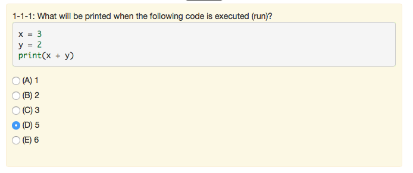
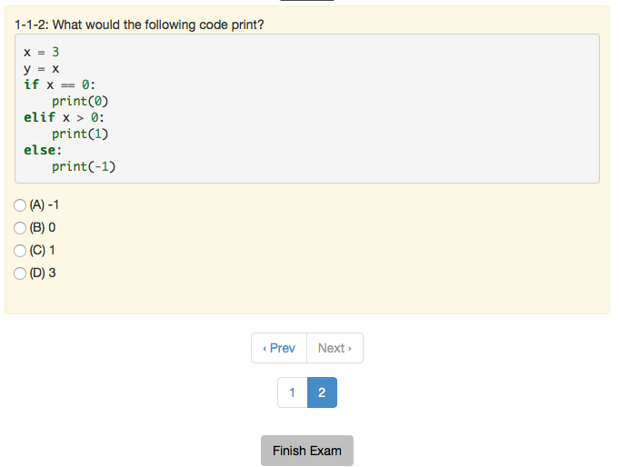

.. qnum::
   :prefix: 1-1-
   :start: 1
   
.. |start| image:: Figures/start.png
    :height: 24px
    :align: top
    :alt: start
    
.. |next| image:: Figures/next.png
    :height: 24px
    :align: top
    :alt: next
    
.. |prev| image:: Figures/prev.png
    :height: 24px
    :align: top
    :alt: prev
    
.. |right| image:: Figures/rightArrow.png
    :height: 24px
    :align: top
    :alt: right arrow for next page
    
.. |finish| image:: Figures/finishExam.png
    :height: 24px
    :align: top
    :alt: finishExam
   
Introduction to Multiple-Choice Questions
---------------------------------------------

The pre-test and post-test both have multiple-choice tests. This page explains the user interface for the multiple-choice tests.  

Start the Exam
==================

Click the |start| button to start the exam and show the first multiple-choice question.
    
Answer the Question 
=====================

Click on the radio button next to the best answer as shown in the figure below. 

   Figure 3: The first multiple-choice question shown answered
   
Go to the Next Question
=========================

Click on the |next| button below the question to display the next question.  
    
The figure below shows the second multiple-choice question, which is shown after you click the |next| button.  

   Figure 4: The second multiple-choice question shown after you click on the |next| button
    
Finish the Exam
=================

Click on the |finish| button below the question once you have answered all the multiple-choice questions.  The |next| button will be shown in gray (as seen in the figure above) when there is no next question to answer.
    
Go to the Next Page
=====================

Click the right arrow |right| near the bottom right of this page to go to the next page to practice solving multiple-choice questions.

