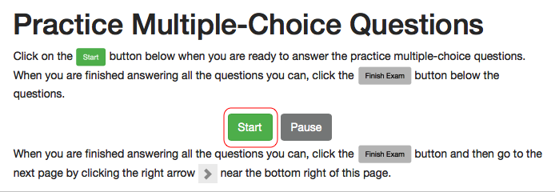
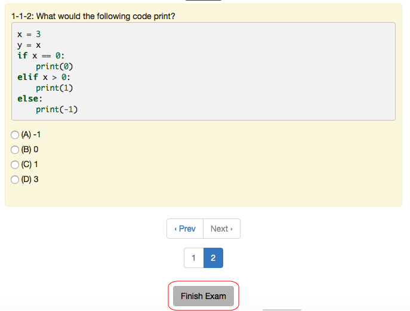
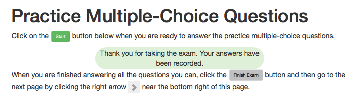

.. qnum::
   :prefix: 1-1-
   :start: 1
   
.. |start| image:: Figures/start.png
    :height: 24px
    :align: top
    :alt: start
    
.. |next| image:: Figures/next.png
    :height: 24px
    :align: top
    :alt: next
    
.. |prev| image:: Figures/prev.png
    :height: 24px
    :align: top
    :alt: prev
    
.. |right| image:: Figures/rightArrow.png
    :height: 24px
    :align: top
    :alt: right arrow for next page
    
.. |finish| image:: Figures/finishExam.png
    :height: 24px
    :align: top
    :alt: finishExam
    
.. |checkme| image:: Figures/checkMe.png
    :height: 20px
    :align: top
    :alt: check me
    
.. |runbutton| image:: Figures/run-button.png
    :height: 20px
    :align: top
    :alt: run button
    
Introduction to The Timed Exams
---------------------------------

The pre-test, practice problems, and post-test all include timed exams.  In a timed exam you will:

#. Click the |start| button to begin the exam.  **Do not leave the page once you have started the exam until you have finished!**
#. Click the |checkme| or |runbutton| button to check your answer on order code, fix code, or write code problems.  You can not check your answer on multiple-choice questions.
#. Click the |finish| button once you have answered all the questions and/or want to move on
#. Click the |right| (right arrow) at the right bottom of the page to move to the next page.  **Do not click on the back or forward button in the browser!** 

1. Click the Start Button to Begin
=====================================

When you first go to the first page with a timed exam it will look like the figure below.  Click the |start| button when you are ready to answer the question or questions. 

   Figure 1: What the page looks like before you click the |start| button.
    
2. Answer each Question and Check your Answer (if allowed)
===============================================================

Please try to answer each question to the best of your ability.  You will not get complete credit if you don't try to answer each question.

You can not check your answer on multiple-choice questions.  

For fix and write code problems you will check your answer by clicking the |runbutton| button.  For order code problems you will click the |checkme| button. **You will not get full credit if you don't click the "Check Me" button on order code problems or the "Run" button on fix or write code problems**.

3.  Finish the Exam
=======================

Click on the |finish| button below the questions when you have answered all of the questions that you can answer.   

   Figure 5: When you have answered all the questions that you can click on the |finish| button.

The page will then look like the figure below.

   Figure 6: What the page looks like after you click on the |finish| button
    
4.  Go to the Next Page
==========================

Use the right arrow |right| at the bottom right side of this page to go to the next page. If you don't see the |right| then you haven't clicked the |finish| button yet.  Be sure to click the |finish| button first. **Do not click on the browser back or forward buttons or go to the table of contents!**

