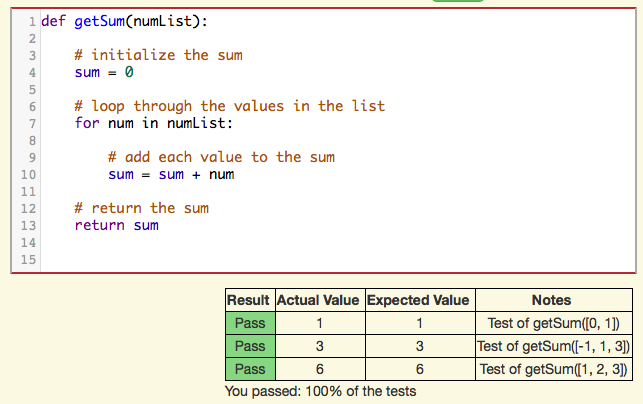

.. qnum::
   :prefix: 1-2-
   :start: 1
   
.. |runbutton| image:: Figures/run-button.png
    :height: 20px
    :align: top
    :alt: run button
    
.. |pass| image:: Figures/pass.png
    :height: 20px
    :align: top
    :alt: pass
    
.. |fail| image:: Figures/fail.png
    :height: 20px
    :align: top
    :alt: fail
    
.. |right| image:: Figures/rightArrow.png
    :height: 24px
    :align: top
    :alt: right arrow for next page

               
Introduction to Fix Code Problems
-----------------------------------

In fix code problems you will be given code for a function, but the code will contain errors.  The function is followed by hidden code that tests the function.  You will click the |runbutton| button to try and compile and run the code.  If there are any compile time errors they will be displayed below the code as shown in Figure 1.  The error shown in Figure 1 is because line 7 is missing a ``:`` at the end of the code.

    Figure 1: Fix code problem with a compiler error displayed below the code   
    
After you fix all the compile time errors the tests that are provided after the function will run.  If any of these tests print |fail| then there is still something wrong with the code such as a logic error as shown in Figure 2 below.  In this case the sum was initialized to 1 instead of 0 on line 4.  If any of tests fail then fix the code and run it again.

    Figure 2: Fix code problem with tests that failed.
    
When you have fixed all the errors in the code the tests will all print |pass| after you click on the |runbutton| button as shown in Figure 3 below. 

    Figure 3: Fix code problem with all tests passing.
    
Click the right arrow |right| near the bottom right of this page to go to the next page to practice solving a fix code problem.
           
