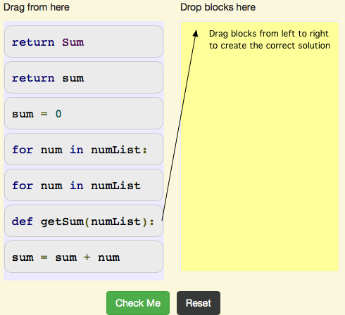
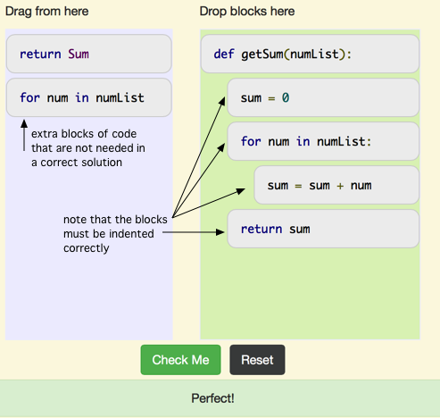
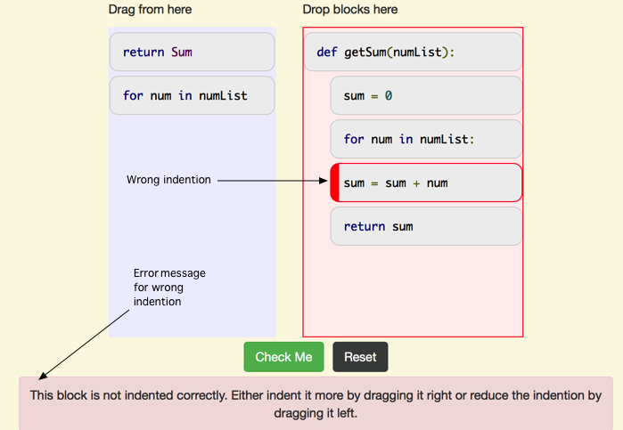
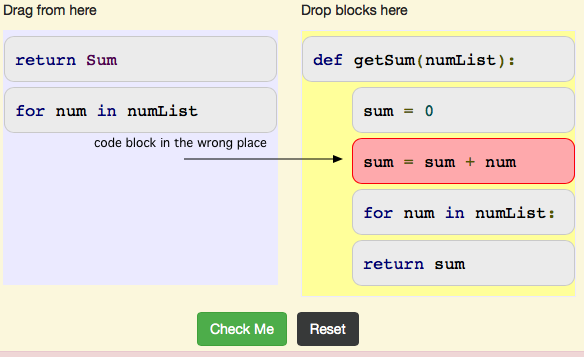

.. qnum::
   :prefix: 1-3-
   :start: 1
   
.. |checkme| image:: Figures/checkMe.png
    :height: 20px
    :align: top
    :alt: check me
    
.. |right| image:: Figures/rightArrow.png
    :height: 24px
    :align: top
    :alt: right arrow for next page

Introduction to Order Code Problems (Mixed Up Code)
-----------------------------------------------------

In order code problems the correct code is given, but it is broken into code blocks and is mixed up shown in Figure 1.  

    Figure 1: What an Order Code Problem Looks Like When You Start
    
You will drag the needed code blocks from left to right to create a correct solution on the right side.  There may be additional code blocks that you don't need in the correct solution as shown in Figure 2.  You will click the |checkme| button to check your solution. 

.. note::

   You will also have to indent the code blocks correctly, which you can do by dragging the blocks right to indent or left to reduce the indention.
    

    Figure 2: What an Order Code Problem Looks Like When You Finish
    
    
You will be told if a block is not correctly indented as shown in Figure 3.
    

    Figure 3: What an Order Code Problem Looks Like When the Indentation is Wrong
    
You will be told if a block is in the wrong place or needs to be replaced as shown in Figure 4.

    Figure 4: What an Order Code Problem Looks Like When a Block is in the Wrong Place or Should be Replaced
    
Click the right arrow |right| near the bottom right of this page to go to the next page to practice solving an order code problem.