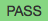

.. qnum::
   :prefix: 1-4-
   :start: 1
   
.. |runbutton| image:: Figures/run-button.png
    :height: 20px
    :align: top
    :alt: run button
    

    
.. |fail| image:: Figures/fail.png
    :height: 20px
    :align: top
    :alt: fail
    
.. |right| image:: Figures/rightArrow.png
    :height: 24px
    :align: top
    :alt: right arrow for next page
           
Introduction to Write Code Problems
------------------------------------

In write code problems you will be given the start of a function followed by code to test the function and will be asked to finish writing the function as shown in Figure 1 below.  

    Figure 1: What a Write Code Problem Looks Like When You Start

The tests that are after the function will check that the function returns the correct values after you click the |runbutton| button.  Each test will print |pass| if the test was successful as shown in Figure 2 or |fail| if it was not.

    Figure 2: What a Write Code Problem Looks Like When all Tests Pass

Click the right arrow |right| near the bottom right of this page to go to the next page to practice solving a write code problem.
           

