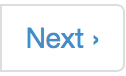

.. qnum::
   :prefix: 2-1-
   :start: 1
   
.. |start| image:: Figures/start.png
    :height: 24px
    :align: top
    :alt: start
    

    

    
.. |finish| image:: Figures/finishExam.png
    :height: 24px
    :align: top
    :alt: finishExam
    
.. |right| image:: Figures/rightArrow.png
    :height: 24px
    :align: top
    :alt: right arrow for next page
   
Pretest Multiple-Choice Questions
-----------------------------------

Please answer the following multiple-choice questions to the best of your ability.  Click the |start| button when you are ready to begin the exam.  Click on the |next| button below the question to display the next question.  Click on the |finish| button when you have answered all the questions that you can answer.   

.. timed:: pretest_mc_timed
   :timelimit: 15
   :noresult:
   :nofeedback:
       
   .. mchoice:: pre1
      :answer_a: -1
      :answer_b: 2
      :answer_c: 3
      :answer_d: 5
      :answer_e: 8
      :correct: c
      :feedback_a: This answer would be true if the end value was 4 rather than 3.
      :feedback_b: This answer would be true if the start value was 0 rather than 1.
      :feedback_c: This would be true if it was looking for the largest value in the list from start to end (inclusive), but it finds the smallest value.
      :feedback_d: The range function returns a list from first to (last - 1) so this will look for the smallest value from index 1 to 3 and so return 3.  
      :feedback_e: This would be true if range returned a list of values from the first to last but it returns from first to last - 1.

      What does the following function return from mystery([2, 5, 8, 3, -1],1,3)?
       
      ::
          
           def mystery(numList, start, end):
               save = numList[start]
               for index in range(start,end+1):
                  value = numList[index]
                  if value < save:
                      save = value
               return save

   .. mchoice:: pre2
      :answer_a: It is the length of the shortest consecutive block of the value target in nums
      :answer_b: It is the length of the array nums
      :answer_c: It is the length of the first consecutive block of the value target in nums
      :answer_d: It is the number of occurrences of the value target in nums
      :answer_e: It is the length of the last consecutive block of the value target in nums
      :correct: d
      :feedback_a: It doesn't reset lenCount ever, so it just counts all the times the target value appears in nums.
      :feedback_b: It only increments the lenCount when the current num is equal to the target.
      :feedback_c: It doesn't reset lenCount ever, so it just counts all the times the target value appears in the array.
      :feedback_d: The variable lenCount is incremented each time the current array element is the same value as the target. It is never reset so it counts the number of occurrences of the value target in nums. The method returns maxLen which is set to lenCount after the loop finishes if lenCount is greater than maxLen.
      :feedback_e: It doesn't reset lenCount ever, so it just counts all the times the target value appears in the array.

      Consider the following function ``findLongest`` which is intended to find the longest consecutive block of the value ``target`` occurring in the list ``nums``; however ``findLongest`` does not work as intended.  For example, if the list ``nums`` contains the values [7, 10, 10, 15, 15, 15, 15, 10, 10, 10, 15, 10] the call ``findLongest(10, nums)`` should return 3, the length of the longest consecutive block of 10s.  Which of the following best describes the value actually returned by a call to ``findLongest``?  
       
      ::
               
           def findLongest(target, nums):
               lenCount = 0
               maxLen = 0
               for num in nums:
                   if num == target:
                       lenCount = lenCount + 1
                   else:
                       maxLen = lenCount
               if lenCount > maxLen:
                   maxLen = lenCount
               return maxLen               
          
   .. mchoice:: pre3
      :answer_a: 0
      :answer_b: 1
      :answer_c: 2
      :answer_d: 3
      :answer_e: 4
      :correct: a
      :feedback_a: While this loops through the indices from 1 to 3 it compares the index to the target and so count remains 0.
      :feedback_b: This would be true if it compared the value at the index to the target, but it compares the index to the target.
      :feedback_c: This would be true if the range included the last value and the code compared the value at the index to the target.
      :feedback_d: This would be true if the start value was 0 and the range included the last value, and the code compared the value at the index to the target.
      :feedback_e: This would be true if the start value was 0 and the end value was 6 and the code compared the value at the index to the target. 

      Given the following function definition, what would be returned from mystery(5, 1, 4, [5, 1, 5, 5, 5])?
      ::

          def mystery(target, start, end, numList):
              count = 0
              for index in range(start, end):
                  current = index
                  if current == target:
                      count = count + 1
              return count
          
   .. mchoice:: pre4
      :answer_a: a = 11 and b = 2
      :answer_b: a = 12 and b = 1
      :answer_c: a = 3 and b = 11
      :answer_d: a = 8 and b = 5
      :answer_e: a = 5 and b = 8
      :correct: e
      :feedback_a: This would be true if it was range(1,3).
      :feedback_b: This would be true if it was range(1,5).  Remember that range doesn't include the second value.
      :feedback_c: Not quite.  Check your tracing.
      :feedback_d: Not quite.  Check your tracing.  
      :feedback_e: Good job tracing this! 

      What do ``a`` and ``b`` equal after the following code executes?
      ::

          a = 10
          b = 3
          t = 0
          for i in range(1,4):
              t = a;
              a = i + b;
              b = t - i;
              
   .. mchoice:: pre5
      :answer_a: 15.0
      :answer_b: 30.0
      :answer_c: 20.0
      :answer_d: 25.0
      :answer_e: 0
      :correct: d
      :feedback_a: This would be true if start was 0 and end was 1.
      :feedback_b: This would be true if start was 2 and end was 2.
      :feedback_c: This would be true if start was 0 and end was 3.  
      :feedback_d: This is 20 + 30 = 50 / 2 = 25.0.
      :feedback_e: This would be true if end was less than start.  

      Given the following code what will mystery([10,20,30],1,2) return?
      ::
      
          def mystery(numList, start, end):
              sum = 0
              for index in range(start,end+1):
                  value = numList[index]
                  sum = sum + value
              if (end - start + 1) >= 1:
                  return sum / (end - start + 1)
              return 0
		   
When you are finished answering all the questions you can, click the |finish| button and then go to the next page by clicking the right arrow |right| near the bottom right of this page.   