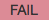
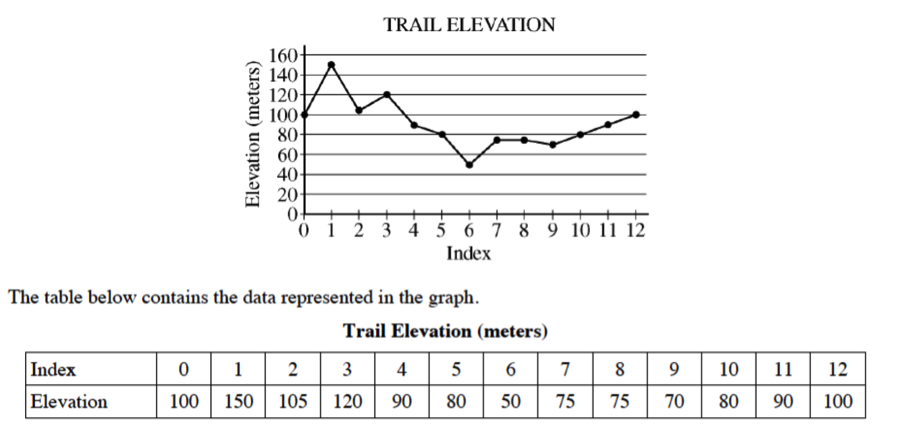

.. qnum::
   :prefix: 2-4-
   :start: 1
   
.. |runbutton| image:: Figures/run-button.png
    :height: 20px
    :align: top
    :alt: run button   
    
.. |pass| image:: Figures/pass.png
    :height: 20px
    :align: top
    :alt: pass
    

    
.. |start| image:: Figures/start.png
    :height: 24px
    :align: top
    :alt: start
    
.. |finish| image:: Figures/finishExam.png
    :height: 24px
    :align: top
    :alt: finishExam
    
.. |right| image:: Figures/rightArrow.png
    :height: 24px
    :align: top
    :alt: right arrow for next page
            

Pretest Write Code Problem
----------------------------

Finish writing the ``isLevelTrailSegment(elList,start,end)`` function which returns ``True`` when the trail segment is level and ``False`` otherwise.
A trail segment is defined by a starting marker, an ending marker, and all markers between those two markers (including the start and end markers). The parameters of the method are the list of elevations at the markers, the index
of the starting marker, and the index of the ending marker. 

The method should return true if the difference
between the maximum elevation and the minimum elevation in the trail segment is less than or equal to
10 meters.  To determine if the trail is level first set the min and max values to the value at the start index. Loop from the start index to the end index (inclusive).  If the value at the current index is less than the min, set the min to the current value.  If the value at the current index is greater than the max, set the max to the current value.  Return true if the difference between the max and min is less than or equal to ten, otherwise return false.

Examples
============

For the trail shown in Figure 1 below, the trail segment starting at marker 7 and ending at marker 9 has elevations ranging from 70 to 75 meters.  Because the difference between 75 and 70 is less than 10 it is considered level.  The trail segment starting at marker 7 and ending at
marker 10 has elevations ranging between 70 and 80 meters. Because the difference between 80 and 70 is
equal to 10, the trail segment is also considered level.
The trail segment starting at marker 2 and ending at marker 12 has elevations ranging between 50 and
120 meters. Because the difference between 120 and 50 is greater than 10, this trail segment is not considered level.

    Figure 1: The trail elevation as a graph and as a table

See the table below for a summary of the examples above.  

======= ===== =======  ====== ================  ===========
 Start   End    Max     Min   Difference <= 10   is Level?
======= ===== =======  ====== ================  ===========
   7      9      75      70          5			  True
   7     10      80      70         10            True
   2     12     120      50         70            False
======= ===== =======  ====== ================  ===========

Write Code Here
================
    
Finish writing the ``isLevelTrailSegment(elList,start,end)`` function below so that the code compiles and all tests print |pass| when you click the |runbutton| button.

Click on the |start| button below when you are ready to try to finish writing this code.  You will have up to 10 minutes to try to write it.  Click on the |finish| button when you have solved this problem or wish to move on without solving it.
       
.. timed:: pretest_is_level_timed
   :timelimit: 10
   :noresult:
   :nofeedback:
   
   .. activecode:: Pretest_Is_Level
   
      # Write the isLevelTrailSegment function below
      # It should take a list of elevations, a start index, 
      # and an end index
      # It should find the minimum elevation and maximum elevation
      # between the start and the end index and return true if the 
      # difference between the maximum elevation and the minimum 
      # elevation between the start and end index (inclusive) is 
      # less than or equal to 10 and return false otherwise
      def isLevelTrailSegment(elList,start,end):
      
      ====

      # code to test the isLevelTrailSegment function
      from unittest.gui import TestCaseGui

      class myTests(TestCaseGui):

          def testOne(self):
              elevList = [100, 150, 105, 95, 95, 90, 50, 75, 75, 70, 80, 90, 100]
              self.assertEqual(isLevelTrailSegment(elevList,7,9),True,"The trail from marker 7 to 9 should be level")
              self.assertEqual(isLevelTrailSegment(elevList,7,10),True,"The trail from marker 7 to 10 should be level")
              self.assertEqual(isLevelTrailSegment(elevList,2,12),False,"The trail from marker 2 to 12 should not be level")
              self.assertEqual(isLevelTrailSegment(elevList,9,11),False,"The trail from marker 9 to 11 should not be level")
		   
      myTests().main()
   
When you are finished with this problem, or are ready to move on, click the |finish| button and then go to the next page by clicking the right arrow |right| near the bottom right of this page.    
