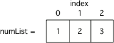

.. qnum::
   :prefix: 3-1-
   :start: 1
   
.. |runbutton| image:: Figures/run-button.png
    :height: 20px
    :align: top
    :alt: run button
    
.. |right| image:: Figures/rightArrow.png
    :height: 24px
    :align: top
    :alt: right arrow for next page
    
What is a List?
-----------------
   
A list in Python holds items in an order.  A list consists of zero or more items between ``[`` and ``]`` and the items are separated by commas.  

The following code creates a variable ``numList`` that refers to a list of three items.  Click the |runbutton| button to see the output.

.. activecode:: IndexExample

   numList = [1,2,3]
   print(numList)

Using Range to Create a List
-----------------------------
   
In Python you can create a list of numbers using the ``range`` function.  This function can take one, two, or three input values.  

If you pass one input to the ``range`` function like this ``range(stop)``.  It will return a list of integers starting with 0 up to ``stop-1``.  
For example, ``range(3)`` will return the list ``[0, 1, 2]``.  Click the |runbutton| button to see the output.

.. activecode:: rangeExample1

   numList = range(3)
   print(numList)
   
If you pass two inputs to the ``range`` function like this: ``range(start,stop)``.  It return a list with all the integers from ``start`` to ``stop-1``. For example ``range(1,4)`` will return the list ``[1, 2, 3]``.  Click the |runbutton| button to see the output.

.. activecode:: rangeExample2

   numList = range(1,4)
   print(numList)

If you pass three inputs to the ``range`` function like this: ``range(start,stop,step)``.  It will return a list created by starting with the ``start`` value and adding ``step`` to it in order to get the next value in the list until it reaches the ``stop`` value.  The returned list will not include the ``stop`` value.  For example ``range(0,10,2)`` would return ``[0, 2, 4, 6, 8]``.  Click the |runbutton| button to see the output.

.. activecode:: rangeExample3

   numList = range(0,10,2)
   print(numList) 
   numList = range(1,10,2)
   print(numList)  

Getting a Value from a List
-----------------------------

As shown in Figure 1 the item at index 0 is 1.  The item at index 1 is 2.  The item at index 2 is 3.  
   

    
    Figure 1: A variable that refers to a list with 3 items.

You can get the value from index 0 using ``listName[0]``.  You can get the value from index 1 using ``listName[1]``.  Click the |runbutton| button to see the output. 

.. activecode:: getListValue

   numList = [1,2,3]
   value = numList[0]
   print(value)
   value = numList[1]
   print(value)
   value = numList[2]
   print(value)

Getting the Length of a List
------------------------------

To get the length of a list (the number of items in it) use ``len(listName)``.  For example ``len([1,2,3])`` would return 3.  Click the |runbutton| button to see the output.

.. activecode:: getListLen

   aList = [1,2,3]
   print(len(aList))

Looping through all the Items in a List
----------------------------------------

In Python you can loop through the elements of a list using ``for elementName in listName``.  The first time through the loop ``elementName`` will refer to the first item in the list (the one at index 0).  The second time through the loop ``elementName`` will refer to the second item in the list (the one at index 1).  The last time through the loop ``elementName`` will refer to the last item in the list (the one at index len(listName) - 1).  Click the |runbutton| button to see the output. 

.. note::

   Only use this type of ``for`` loop when you want to loop through *all* of the values of the list.  If you want to loop through only some of the values in a list use the ``range`` function to create a list of the indicies you want.
   
.. activecode:: loopThroughList

   aList = [1,2,3,4]
   for num in aList:
       print(num)

Looping through a Range of Index Values
----------------------------------------

You can loop through just part of a list by getting a range of indices using a start and stop input value: ``range(start,stop)``.  This will loop from the ``start`` index to ``stop-1``.  For example, ``range(3,5)`` will return the list ``[3,4]`` and the code below will print just the values at indicies 3 and 4.  Click the |runbutton| button to see the output. 

.. note::

   Note that the generated list will not include the ``stop`` value.  If you want to include the ``stop`` value use ``range(start,stop+1)`` instead.  Also be sure to get the value at the index (``aList[index]``) in the body of the loop, and don't just work with the index as if it is the value in the list.  

.. activecode:: loopThroughRange

   aList = [10, -1, 99, 32, 18, 5, 67]
   for index in range(3,5):
       print(index)
       print(aList[index])
       
Click the right arrow |right| near the bottom right of this page to go to the next page

 

               
